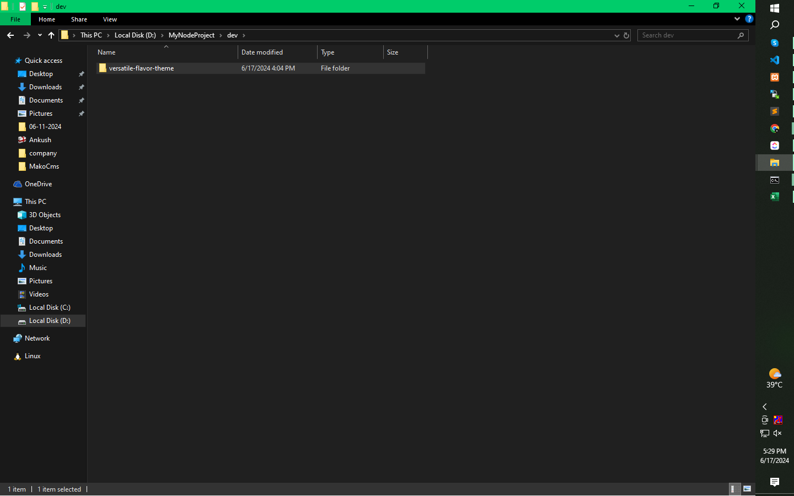

# How to install Shopify Cli
## Open this url :- https://shopify.dev/docs/api/shopify-cli#contribute
## Open this url :- https://community.shopify.com/c/shopify-cli-and-tools/error-coming-from-bundle-install/td-p/2595997 
## Open this url :- https://shopify.dev/docs/storefronts/themes/getting-started/create

## System Requirements (Latest Version)
- Node js:- (https://nodejs.org/en/download/prebuilt-installer)
- Git :- (https://git-scm.com/downloads)
- Ruby+kit:- Click here (https://github.com/oneclick/rubyinstaller2/releases/download/RubyInstaller-3.1.2-1/ rubyinstaller-devkit-3.1.2-1-x64.exe)
- Gem:- use this commnad (gem install bundler)

## Install Cli (run command)
- npm install -g @shopify/cli

## Creat new Folder Drive D: Dev
* open cmd (D:\dev)
## use Commands
- shopify theme init

